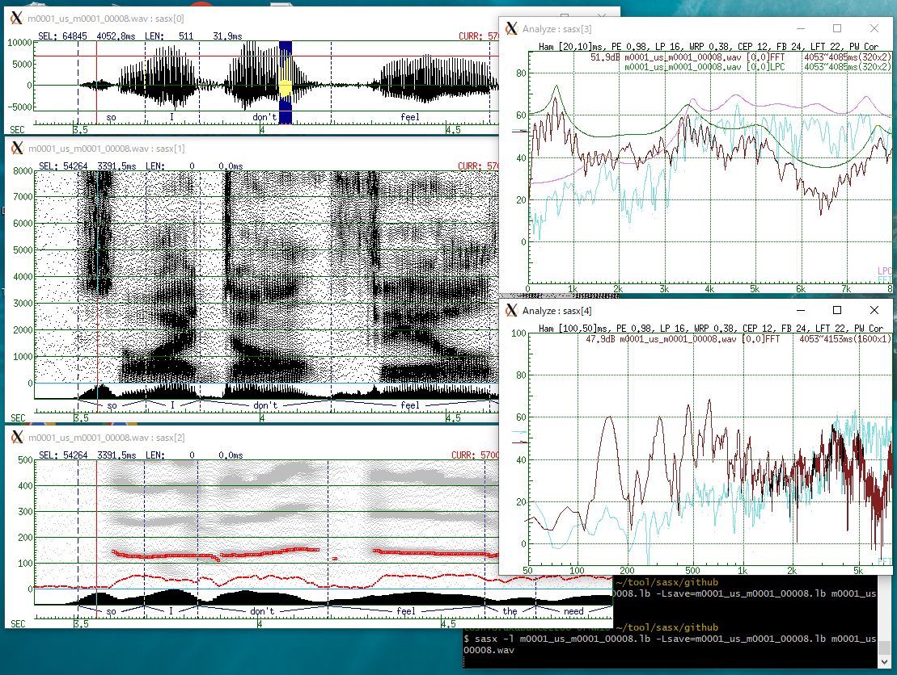

# sasx

  

### What is it?
- sasx (Speech Analysis System on X-Window) is a wave viewer and spectrum analyzer.
- multiple files in multiple windows with synchronized cursors.
- supports .raw {uint8, int8, int16, int32, float, double}, and .wav(RIFF).
- {type, rate, chan, endian} specified with commandline and popup menu.
- unlimited file size (depends on the system resource).
- fast rendering of tens of minutes data.
- keyboard based UI witout graphical UI parts for the maximum contents display.
- popup menus with mouse-middle-button.
- dpends on just X-window, no widgets or toolkit needed. easy to transport.
- commandline options for cooperation with other programs/scripts.

### Waveform and Spectrogram (time window):
- up to 512 files (defined by MAX_OBJ), each in separate window.
- synchronized cursors among windows.
- display ranges, and selected ranges are synchronizable among windows. 
- waveform and spectrogram are switchable in each window.
- wide-band and narrow-band spectrogram with custom parameter.
- render spectrogram with dither(default), grayscale, or colorscale.
- experimental pitch detection.
- show and edit segment label or ATR-style label.

### Spectral Analysis (ana window):
- spectral graph of {FFT, LPC, LPCCEP, MFCC, etc} analysis.
- compare spectrums of all selected areas in the time windows.
- spectrum at the mouse-over point in real time.
- selectable window-size, preemphasis, lpc-order etc. by commandline and popup menu.
- frequency scale is selectable from {LINEAR, MEL and LOG}.

### Playback:
- sox is required for playback.
- play selected area, or play from selected point to the end.
- play while pressing mouse-right-button or ALT-key
- play selected time & frequency region by selecting with pressing ctrl-key
- looped play with shift-mouse-right or shift-ALT 

### Key Bindings on time window:
- a ...... show whole the file.
- ^A ....  scroll to the begining
- b ...... scroll backward 100%
- B ...... scroll backward 10%
- ^B .... scroll backward 1 pixel
- ^E .... scroll to the end of file
- f ...... scroll forward 100%
- F ...... scroll  forward  10%
- ^F .... scroll forward 1 pixel
- g ...... gain up x2
- G ...... gain down 1/2
- i ...... toggle pitch detection
- l ...... toggle synchronization lock (shows '*' at top-left of the window)
- ^L .... redraw the window
- m ...... switch mode {waveform - spectrogram}
- M ...... switch mode {waveform - MFCCspectrogram}
- n ...... duplicate the window (with selected area if selected)
- o ...... toggle power graph on spectrogram
- p ...... spectrogram frequency zoom up (to voice pitch area)
- P ...... spectrogram frequency zoom down (to niquist freq)
- s ...... switch time scale {sec - HMS - sample - frame(see -m option)}
- ^Q .... close all windows and terminate
- ^X .... close focused window
- y ...... synchronize other windows' display area
- z ...... zoom up display area (x2), or zoom in to selected area.
- Z ...... zoom down display area (1/2)
- 0 ...... create analysis window
- ALT .... playback while pressing

### Mouse Operation on time window:
- left-click .... select a time (start position of playback)
- left-drag .... select area
- shift-left-click, shift-left-drag .... select in all synchronized windows
- ctrl-left-drag on spectrogram .... select time & frequency region (filterd playback)
- right-press .... playback while pressing the button.
- shift-right-press .... loop playback while pressing the button
- ctrl-right-press .... inverse-filtered playback (eliminate the selected frequency)
- mid-press .... popup menu

### Key Bindings for Label Editing:
- r ...... toggle display arcs around each label (when overlapped label)
- / ...... divide label by half
- ! ...... merge two labels ()
- \+ ...... create a new label at selected area
- DEL .... delete selected label
- TAB .... select next label
- shift-TAB .... select previous label

### Mouse Operation for Label Editing:
- click on the boundary .... select boundary
- drag the selected boundary .... move boundary (do not separate adjoined segments)
- shift-drag the selected boundary .... copy a label acording to the direction
- ctrl-drag the selected boundary .... move boundary separating adjoined segments
- click on a label area .... select the label
- click on selected label string .... edit label string.
  (if -Lstd was given, label can be edited on console window.)

### Key Bindings on ana window:
- 0 ...... toggle FFT
- 9 ...... toggle LPC
- 8 ...... toggle LPC CEPSTRUM 
- 7 ...... toggle LPC MEL
- 6 ...... toggle LPC MEL CEPSTRUM
- 5 ...... toggle MFCC
- 4 ...... toggle MFCC2 (modified version to get closer to FFT)
- h ...... toggle window type {HAMMING | SQUARE}
- p ...... toggle preemphasis
- l ...... toggle synchronization lock (shows '*' at top-left of the window)
- s ...... change frequency scale {LINEAR | MEL | LOG}
- w ...... toggle single-window
- ^L .... redraw
- ^Q .... close all windows and treminate
- ^X .... close the window

### Mouse Operation on ana window:
- vertical scale (arrow pointer icon)
  - left-click .... zoom up by x1.4 vertically
  - left-drag .... move vertical scale
  - ctrl-left-drag .... manual zoom vertically
  - right-click .... restore default
- horizontal scale (arrow pointer icon)
  - left-click .... zoom up by x1.4 horizontally
  - left-drag .... move horizontal scale
  - ctrl-left-drag .... manual zoom horizontally
  - right-click .... restore default

### Plot graph:
- plot xgraph-like text file

### Commandline option:
```
sasx [option] file [[option] file ...]
    -h                   this help message
    -display dispname    X server name
    -t {C|S|L|F|D|A|P}   C:char S:short F:float D:double  [N]
                         A:ascii P:plottxt(x,y) N:auto
    -c chan              # of channels                    [1]
    -e {l|b}             {little|big} endian              [l]
    -f freq              sampling frequency(kHz)          [12]
    -g WxH+X+Y           window geometry                  [512x128+0+0]
    -b pixel             window manager border width      [0]
    -l labelfile         labelfile
    -m frameskip         for analysis and scale(ms)       [5]
    -n framesize         for analysis window(ms)          [20]
    -s start,len         select area(sample)              [0,0]
    -v start,len         view area(sample)                all
    -y ymin,ymax         amplitude view area              [-32768,32767]
    -d dbmin,dbmax       power(db) view area              [-10,100]
    -L save=filename     labelfilename to save            [no save]
    -L std[={0|1}]       edit label from stdin            [no edit]
    -L mode={0|1|2|3}    0:dup 1:sft 2:splt 3:splt-dup    [0]
    -L arc[={0|1}]       draw arc around string           [0]
    -L type={0|1|2|3}    0:auto 1:seg 2:atrphm 3:cvi      [0]
    -M [mpoigsfFz]       startup mode(key bindings)
    -N size,skip         narrowband analysis(ms)          [100.0,10.0]
    -W size,skip         wideband analysis(ms)            [5.0,0.5]
    -V skip(fb),skip(FB) view skip speed(%)              [100.0,10.0]
    -S spow=val          spectra contrast(0.1,1)          [0.35]
    -S sgain=val         spectra saturation(10-30000)     [2000]
    -S color={0|1|2}     spectra 0:BW 1:gray 2:color      [0]
    -S power={0|1}       spectra 0:off 1:on               [1]
    -S fmax=freq         spectra maxfreq. (0:auto)        [0]
    -S fscale={0|1}      spectra 0:linear 1:mel           [0]
    -S pre=coef          pre-emphasis for spectrogram     [0.95]
    -C name=color        name{fg|bg|sc|cs|mk|dim}
                         fg:foreground
                         bg:background
                         sc:scale
                         cs:cursor
                         mk:marker
                         dim:dimmed spectrogram
    -C name=pixel        name{mw|mgn|pm}                  [1|4|0]
                         mw:  label_marker_width
                         mgn: grab_margin_width
                         pm:  plot_marker_triangle
    -C font=name         8bit ascii font                  [fixed]
    -C font16=name       16bit japanese font              [k14]
    -a                   create analyze window
    -A pre=coef          pre_emphasis for analyze         [0.98]
    -A lag=coef          lag window coef for lpc          [0.01]
    -A lpc=order         lpc order for analyze            [16]
    -A warp=coef         warp Coef. in lpc-Mel            [0.38]
    -A cep=order         cep order for analyze            [12]
    -A fbnum=size        MFCC filterbank size             [24]
    -A lifter=size       MFCC lifter length               [22]

key bindings(time window):
    zZ:timeZoomUp/Down   gG:gainUp/Down        a:All
    ^A:ViewStart         ^E:ViewLast
    FB:ViewArea(100%)    fb:ViewArea(10%)   ^F^B:ViewArea(pixel)
     n:new_window         y:SyncViewArea       m:mode(wave/spect)
     M:mode(wave/mfcc)
     i:TogglePitch        o:ToggleEnergy      pP:frequencyZoom(Up/Down)
     r:ToggleDrawArc      Tab:SelNextSeg       s:scale(sec/HMS/smpl/frame)
     l:toggleNoSync        ^Q:quit            ^X:closeWin
     0:CreateAnalysisWin
key bindings(analyze window):
     0:toggleFFT   9:toggleLPC   8:toggleLPCMEL   7:toggleLPCCEP
     6:toggleLPCMELCEP           5:toggleMFCC
     w:toggleAverage-Single      s:scale(linear/mel/log)
     h:toggleHammingWindow       e:toggleEnergy
     l:toggleLockSync

mouse button bindings(time window):
    MB1:select       shift-MB1:selectSync
    ctrl-MB1onLeftscale:Freq-zoom  ctrl-MB1onSpectrogram:selectRect
    MB2:menu
    MB3:playback
mouse button bindings(analyze window):
    MB1click:zoom*1.4      MB1+drag:move    ctrl+MB1+drag:zoom
    MB2:parameter-menu                 MB3:mode-menu
label edit mode:
    MB1:select,moveSeg    shift-MB1:moveAddSeg    ctrl-MB1:separateSeg
    DEL,BS:delete         u:undo(moveSeg)         !:mergeWithPrevious
    TAB:nextSeg           shift-TAB:prevSeg       +:addLabel
```
### Installation:
- for cygwin, you need gcc, make, xorg-serer, libX22-*, xorg-x11-fonts-*
- for playback, you need to install sox.
- edit Makefile (to fit to your environment)
- make sasx
- makek install  (confirm INSTDIR in Makefile)

see also README_ja.txt (in japanese), but it may be old.

